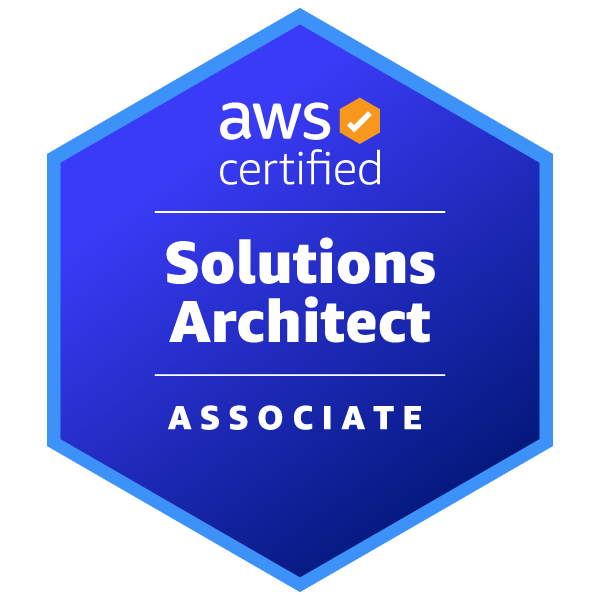
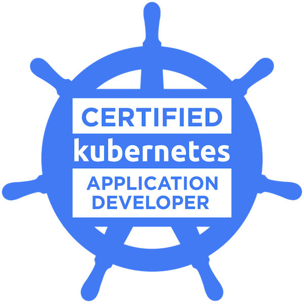
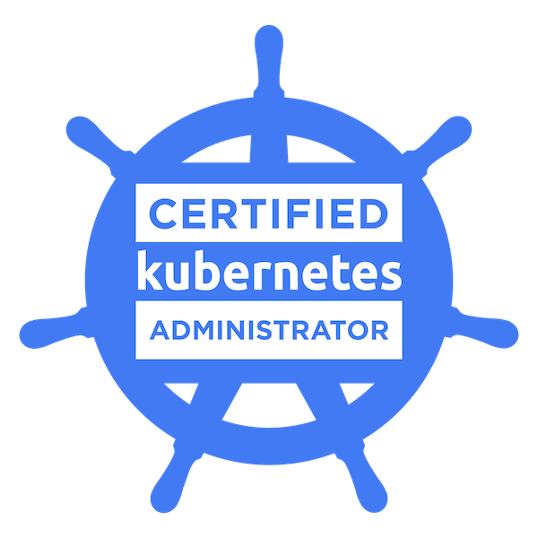

# Hi there 👋. Welcome to my humble GitHub profile

## About me

- A software engineer from Vietnam with great interest in full-stack development, cloud computing, platform engineering, devops, and data engineering
- More than 7 years of professional working experience from outsourcing, startup, to enterprise companies
- Content creator on [LinkedIn](https://www.linkedin.com/in/dienbui/) and [Medium](http://medium.com/dienbui)
- My style and taste:
  - love spending spare time exploring technology used in daily work in-depth and following up with current technology trend.
  - proficient in public speaking, knowledge sharing, especially inspiring young generations in tech ;)
  - I believe that: no engineer is perfect and working in software industry requires more than tech skills, do not judge an engineer solely on tech skills, soft skills are very important, and always give potential people chance and playground to prove and develop themselves
 
## Skills and technology

- **Programming language**: Javascript & Typescript, Python, Ruby, Golang, Java
- **Notable libraries/frameworks**: React, Next.js, Express, Fastify, Apollo GraphQL, Ruby on Rails, gRPC
- **DevOps/Platform engineering tools**: Jenkins, Docker, Kubernetes, Helm, Linux, GitHub, GitHub Actions, Dagger.io, Terraform
- **Cloud providers**: AWS, Azure (beginner)
- **Others**: public speaking, teaching and mentoring

## Certifications

  
