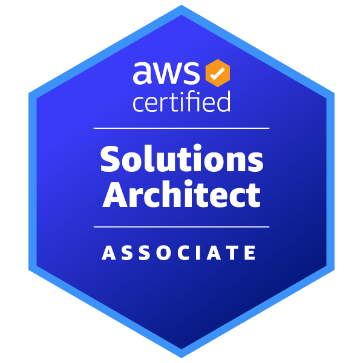
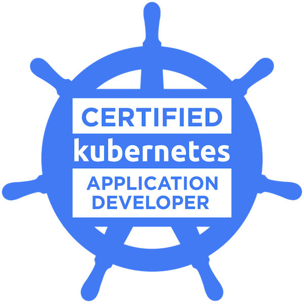
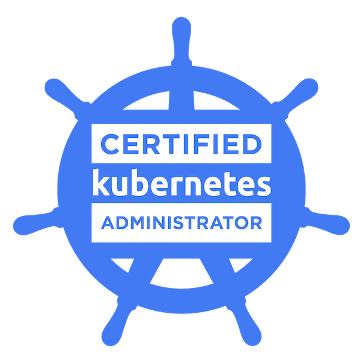

# Hi there 👋 . I am Dien

A friendly neighborhood tech geek, software engineer specialized in full-stack, cloud and platform engineering.

## About me

- A software engineer with great interest in **full-stack development, devops, cloud computing, platform engineering, and data**.
- Graduated from [RMIT University](https://www.rmit.edu.vn/) with Bachelor of Information Technology - Application Programming with Distiction degree
- 8 years of professional working experience, starting as full-stack engineer after university graduation and now devops and platform engineer.
- Content creator on [LinkedIn](https://www.linkedin.com/in/dienbui/) and [Medium](https://medium.com/dienbui)
- My style and taste:
  - love spending spare time exploring technology used in daily work in-depth and following up with current technology trend.
  - proficient in public speaking, knowledge sharing, especially inspiring young generations in tech.
  - continuing to enhance my knowledge and experience in devops, cloud, platform engineering.

## What I'm working on?

💼 Senior Platform Engineer @ [National Australia Bank](https://www.nab.com.au/). Previous worked at: [SalesHood](https://saleshood.com/), [Nash Tech Global](https://www.nashtechglobal.com/)

🧑‍💻 Co-founder and engineer of [Project Cocoon](https://projectcocoon.org/)

## Skills

- **Programming language**: Javascript, Typescript, Python, Ruby, Golang (entry-level), Java (entry-level)
- **Libraries/frameworks**: React, Next.js, Express, Fastify, Apollo GraphQL, Ruby on Rails, FastAPI, gRPC (entry-level)
- **DevOps tools**: Jenkins, Docker, Kubernetes, Helm, Linux, GitHub, GitHub Actions, Dagger.io, Terraform
- **Cloud providers**: AWS, Azure (entry-level)
- **Others**: public speaking, teaching and mentoring

## Certifications

  

## How to reach me

- LinkedIn: <https://www.linkedin.com/in/dienbui/>
- Medium: <https://medium.com/@dienbui>
